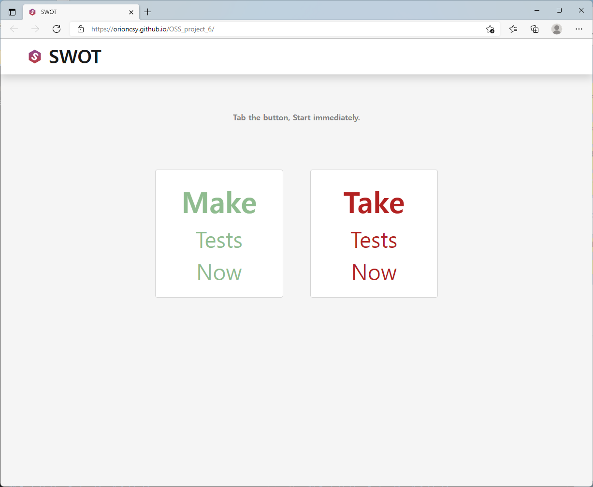
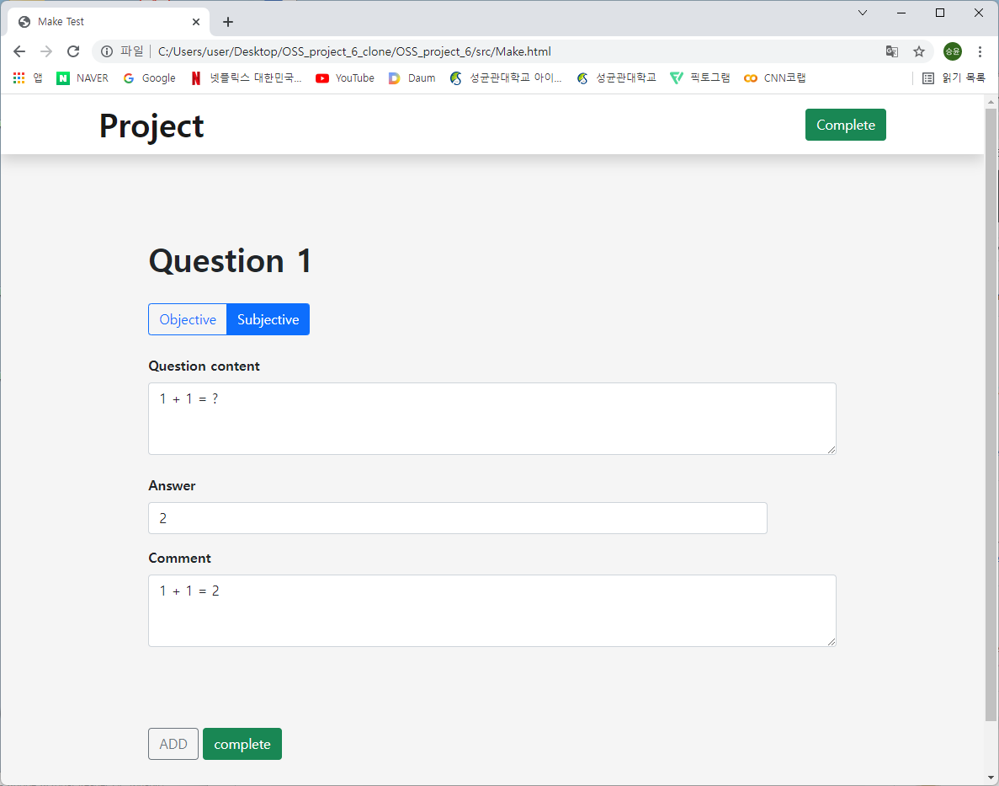
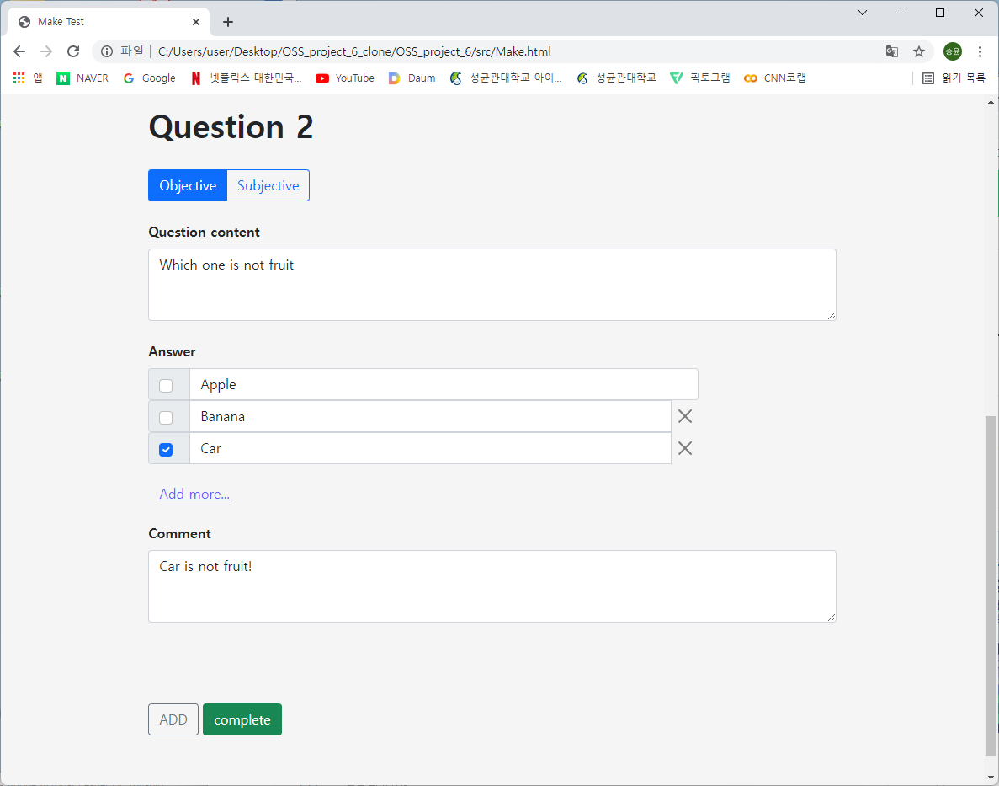
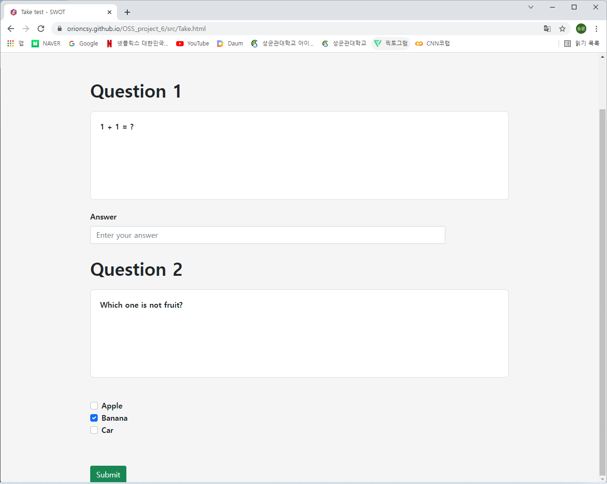

# OSS_project_6

## Team No.6 Members
- Seung-yun Chae(orioncsy@g.skku.edu, 2015312350)
- Jiwan Park(wldhks302@g.skku.edu, 2015318837)
- Dongkun Kim(kdk0@g.skku.edu, 2020312600)

## Name of Application

```js
"SWOT : SoftWare Oriented Test"
Swot means 'study hard for test'
```

## Screenshots of App

### 1. Start Page

When you enter the page at first,


### 2. Make Test Page

If you choose "Make Test", you can make subjective questions just like bellow.


If you want to make objective questions just like bellow.


### 3. Take Test Page

If you choose "Take Test", you can see the question and write answer.


### 4. Correct System Page


## Link to the demo video


- [demo video]()


## Installation Instruction & Guide Line

```js
  You can just enter to "https://orioncsy.github.io/OSS_project_6/" on your web browser.
Then you can find the start page of our program.
Once you enter the start page, you choose two function of app, "Make Tests Now" or "Take Tests Now".
  If you click "Make Tests Now", you can enroll the question.
You can write the question on the "question content" box and write the answer on "answer" box.
Also you can enter the comment on "comment" box. If you want to answer as Objective.
you can click on objective and answer the objective answers and check the right answer.
  If you make more question click "add" button on bottom of page or remove question by trash bin icon.
Then you can finish by clicking on "complete" button on the right side of "add" button.
Now you can come back on the start page.
  If you click "Take Tests Now", you can take the tests.
you can see the question, points and enter your answer on "Answer" box.
Also you can check the answer on the objective question.
  If you finish taking test, you can submit answer sheets by clicking "submit" button on the bottom of the page.
Then you can see the correcting page. We can show you which the question is correct or incorrect.
Also, the page will show the comment and total score as numbers of right answers.
If you want to go back the start page, you can just click on "Home" button on the bottom of the page. 
```


